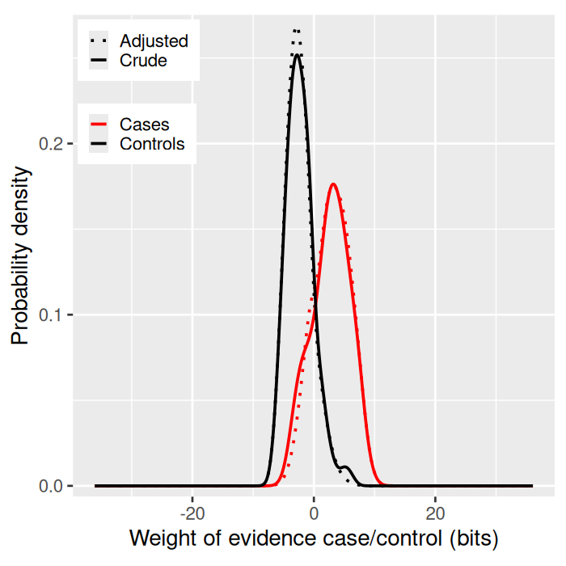
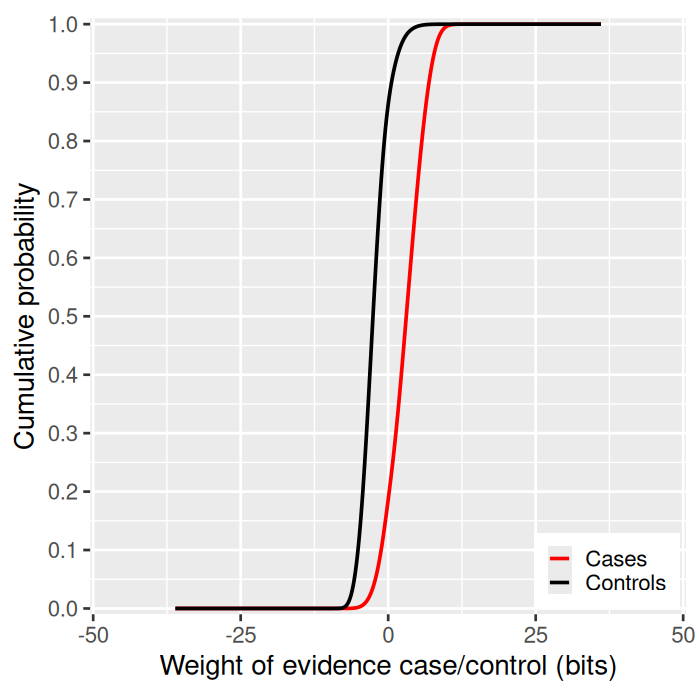
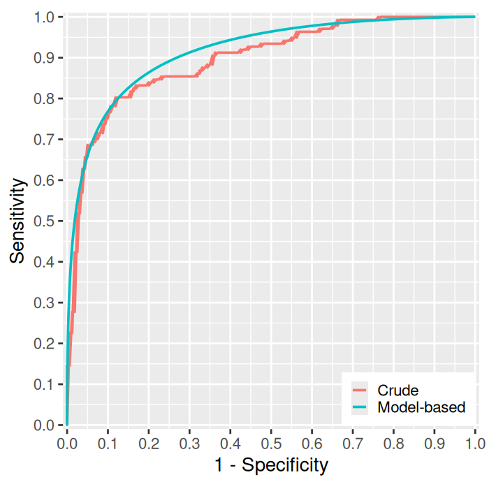
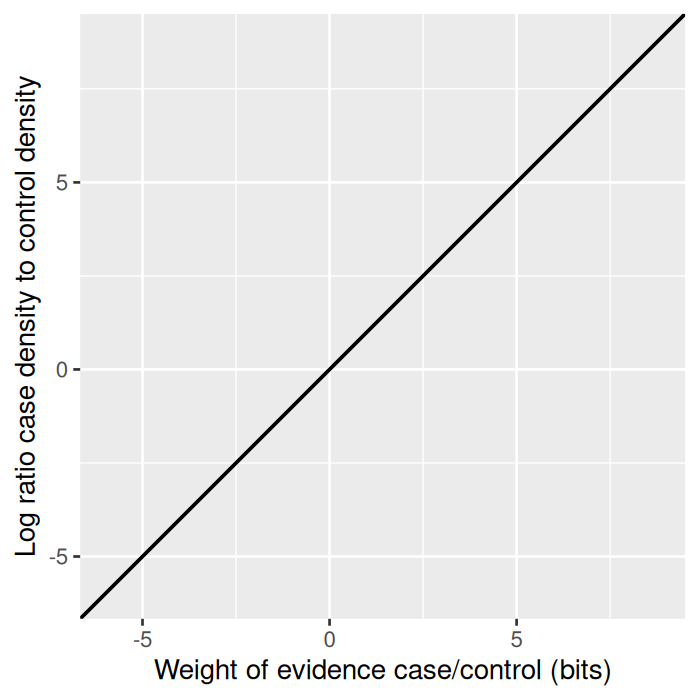

# wevid

Weight of Evidence for Quantifying Performance of a Binary Classifier

## Overview

**wevid** provides functions for quantifying the performance of a diagnostic test (or any other binary classifier) by calculating and plotting the distributions in cases and noncases of the weight of evidence (log Bayes factor) favouring case over noncase status.

In comparison with the C-statistic (area under ROC curve), the expected weight of evidence (expected information for discrimination) has several advantages as a summary measure of predictive performance. To quantify how the predictor will behave as a risk stratifier, the quantiles of the distributions of weight of evidence in cases and controls can be calculated and plotted.

## Installation

Install from GitHub:

```r
# install.packages("devtools")
devtools::install_github("pmckeigue/wevid")
```

## Usage

To use the package, you need a test dataset (or test folds from cross-validation) with:

1. **Prior probabilities** of case status (e.g. frequency of cases in the training data)
2. **Posterior probabilities** of case status (predicted by the model on the test data)
3. **Observed case status** (coded as 0 = noncase, 1 = case)

### Example with the Cleveland Heart Study dataset

```r
library(wevid)
data("cleveland")

# Calculate weights of evidence
W <- with(cleveland, weightsofevidence(posterior.p, prior.p))

# Compute unadjusted and adjusted density estimates
densities.unadj <- Wdensities.unadjusted(cleveland$y, W)
densities.adj <- Wdensities.fromraw(densities.unadj)

# Plot distributions of W in cases and controls
plotWdists(densities.unadj, densities.adj)
```



```r
# Plot cumulative frequency distributions
plotcumfreqs(densities.adj)
```



```r
# Plot crude and model-based ROC curves
plotroc(densities.adj, cleveland$y, W)
```



```r
# Diagnostic plot: log density ratio vs weight of evidence
plotW(densities.adj, W)
```



```r
# Compute model-based AUROC and expected information for discrimination
auroc.model(densities.adj)
#> [1] 0.9153484

lambda.model(densities.adj)
#> [1] 2.653516

# Summary results table
with(cleveland, wtrue.results("cleveland", y, posterior.p, prior.p))
```

| Model | Cases / controls | Test log-likelihood (bits) | Crude C-statistic | Crude Lambda (bits) |
|---|---|---|---|---|
| cleveland | 137 / 160 | -171.94 | 0.895 | 2.47 |

## Key Functions

| Function | Description |
|---|---|
| `weightsofevidence()` | Calculate weights of evidence from posterior and prior probabilities |
| `Wdensities.unadjusted()` | Compute unadjusted kernel density estimates of W in cases and controls |
| `Wdensities.fromraw()` | Adjust densities for mathematical consistency |
| `Wdensities.mix()` | Compute densities for spike-slab mixture distributions |
| `plotWdists()` | Plot crude and adjusted density distributions |
| `plotcumfreqs()` | Plot cumulative frequency distributions |
| `plotroc()` | Plot crude and model-based ROC curves |
| `plotW()` | Diagnostic plot: log density ratio vs weight of evidence |
| `auroc.model()` | Compute model-based area under ROC curve |
| `lambda.model()` | Compute expected information for discrimination (bits) |
| `prop.belowthreshold()` | Proportions of cases/controls below a threshold of W |
| `wtrue.results()` | Summary table of predictive performance metrics |

## Citation

McKeigue P. Quantifying performance of a diagnostic test as the expected information for discrimination: relation to the C-statistic. *Statistical Methods in Medical Research* 2019; 28(6):1841-1851.

## License

GPL-3
